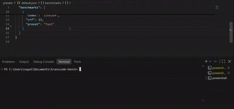

# TranscodeBench

A video transcoding benchmark that makes it easy to compare FFmpeg configurations by quality, file size, and encoding speed.

> During the development of this tool, AI served as a source of documentation, not a single line of code was written by AI.



**[Try it locally](#quick-start)**

## Quick start

The repository includes sample benchmark results, so you can explore the dashboard without running a new transcode first.

```bash
bun install
bun run web
```

Open [http://localhost:5173](http://localhost:5173) in your browser.

## Features

- Compare multiple FFmpeg codecs, CRF values, and presets
- Measure encoding time, realtime speed, output size, bitrate, and compression reduction.
- Calculate optional VMAF scores for visual-quality comparisons.
- Explore results through a detailed table and interactive Chart.js visualizations.
- Define repeatable benchmark suites in a small JSON preset file.
- Save benchmark results as JSON.

## Run it locally

### Requirements

- [Bun](https://bun.sh/) 1.3.10 or newer
- FFmpeg and FFprobe available on your `PATH`
- An FFmpeg build with the `libvmaf` filter when VMAF is enabled

You can check whether your FFmpeg build supports VMAF with:

```bash
ffmpeg -filters | grep libvmaf
```

On Windows PowerShell, use `Select-String libvmaf` instead of `grep`.

### Run a benchmark

Use the default preset:

```bash
bun run start path/to/video.mp4
```

Or provide a custom preset:

```bash
bun run start path/to/video.mp4 path/to/preset.json
```

Then launch the results dashboard:

```bash
bun run web
```

Open [http://localhost:5173](http://localhost:5173). The API serves the latest benchmark from `results/result.json`.

### Create a preset

Edit `presets/default.json` or create another JSON file using the same structure:

```json
{
  "vmaf": true,
  "benchmarks": [
    {
      "name": "x264-medium-crf23",
      "codec": "libx264",
      "crf": 23,
      "preset": "medium"
    }
  ]
}
```

Set `vmaf` to `false` if your FFmpeg build does not include `libvmaf` or if you want a faster benchmark.

## How it works

TranscodeBench runs the input video through every configuration in the selected preset. FFmpeg performs each transcode, FFprobe reads the resulting media metadata, and an optional second FFmpeg pass calculates the VMAF score. The benchmark records all measurements in a JSON result file.

The dashboard reads that same result file through a small Bun API. Its tables, summary statistics, and charts are generated client-side.

## Credits

Built with [Bun](https://bun.sh/), [FFmpeg](https://ffmpeg.org/), [Chart.js](https://www.chartjs.org/), [Vite](https://vite.dev/), and [Zod](https://zod.dev/).
